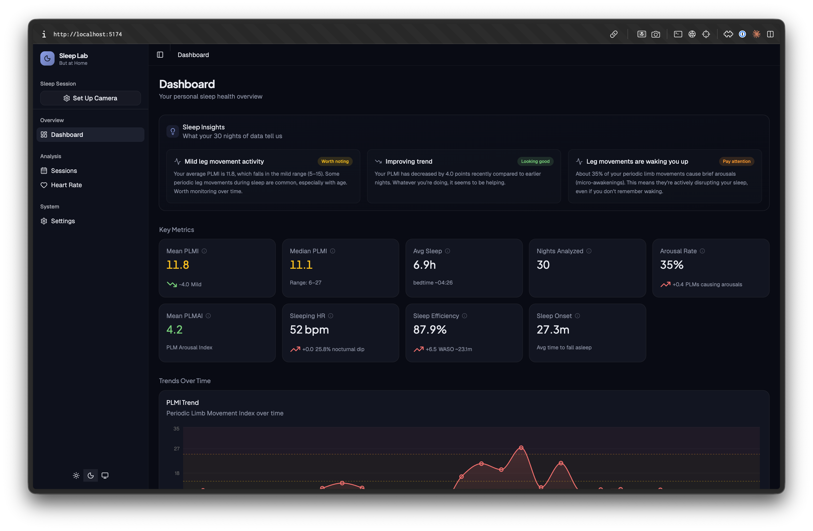

# Personal Sleep Lab

**At-home clinical sleep analytics** — video-based motion detection, PLMS scoring, cardiac arousal monitoring, and sleep quality tracking. All from an IR camera and a heart rate monitor.



> **Heads up** — this is a personal project built for my own use, tested on exactly one person (me) with limited data. It is heavily work-in-progress and breaking changes are more likely than not. Don't rely on any of this for medical decisions.
>
> The entire codebase — backend, frontend, pipeline, infrastructure, and this README — is written by [Claude](https://claude.ai/code). This is an experiment in what it can build and maintain when given full ownership of a project, with a human providing direction and feedback.

---

## What It Does

Sleep Lab turns a UniFi Protect camera and a Bluetooth heart rate monitor into a clinical-grade periodic limb movement study. No wires, no lab visit, no referral wait.

### Motion Analysis

- **Spatial-variance-weighted motion detection** from IR camera video — rejects camera noise and IR artifacts that fool simple frame differencing
- **AASM-compliant PLMS scoring** — duration, interval, and series criteria matching the clinical standard (AASM Manual for the Scoring of Sleep)
- **Body movement classification** — distinguishes periodic limb movements from position changes and rollovers
- Processes video in 1-hour chunks with automatic hourly fetching from UniFi Protect

### Cardiac Arousal Detection

- **Real-time heart rate capture** via Bluetooth Low Energy (any BLE heart rate monitor)
- **PLM-triggered arousal detection** — correlates HR spikes with limb movements to identify clinically significant arousals
- **PLMAI scoring** (PLM Arousal Index) — the metric sleep physicians actually care about
- Dual-threshold system: standard (+10 bpm) and strict (+15%) for research flexibility

### Sleep Quality Metrics

- **Sleep efficiency** — estimated percentage of time in bed actually spent sleeping
- **Sleep onset latency** — time to fall asleep (first 10-minute quiet window)
- **WASO** (wake after sleep onset) — total wake time from motion cluster analysis
- **Nocturnal HR dip** — sleeping vs waking heart rate, with dipper/non-dipper classification

### Dashboard

- 30-night PLMI trend with severity classification (normal / mild / moderate / severe)
- Nightly heart rate analytics — sleeping HR, average HR, min/max range, nocturnal dip
- Hourly movement distribution — see circadian patterns across nights
- Sleep quality trends — efficiency, onset latency, WASO over time
- Per-session drill-down with event timeline, motion signal waveform, and HR overlay
- Full event debug chain — see exactly why each movement was classified the way it was

---

## Architecture

```
                    +-----------+
                    | UniFi     |
                    | Protect   |
                    +-----+-----+
                          | video fetch (hourly)
                          v
+----------+      +-------+-------+      +-----------+
| BLE HR   | ---> |   Backend     | ---> | Postgres  |
| Monitor  | BLE  |  (FastAPI)    | SQL  |   16      |
+----------+      |               |      +-----------+
                  | - pipeline    |            |
                  | - PLMS scoring|            |
                  | - arousal det.|            v
                  +-------+-------+      +-----------+
                          | /api         | Dashboard |
                          +------------> | (React)   |
                                         +-----------+
```

| Component | Stack |
|---|---|
| **Backend** | Python 3.12, FastAPI, asyncpg, OpenCV, SciPy |
| **Dashboard** | React 19, TypeScript, Vite, shadcn/ui, Tailwind CSS v4, Recharts |
| **Database** | PostgreSQL 16 |
| **BLE Service** | Python, bleak (runs on host for Bluetooth access) |
| **Infrastructure** | Docker Compose |

---

## Quick Start

```bash
# Start the dev stack (Postgres + backend + dashboard with hot reload)
make dev

# Seed 30 nights of sample data for demo/testing
make seed

# Open the dashboard
open http://localhost:5174
```

### Other Commands

```bash
make up       # Production stack (nginx on :3000)
make down     # Stop containers
make nuke     # Hard reset — wipe volumes and rebuild
make ble      # Run BLE HR service on host machine
make logs     # Follow container logs
```

### Configuration

1. Open **Settings** in the dashboard
2. Connect your **UniFi Protect** instance (host, credentials, select camera)
3. Optionally enable **BLE** heart rate monitoring
4. Hit **Start Sleep Session** — video fetching and analysis begins automatically
